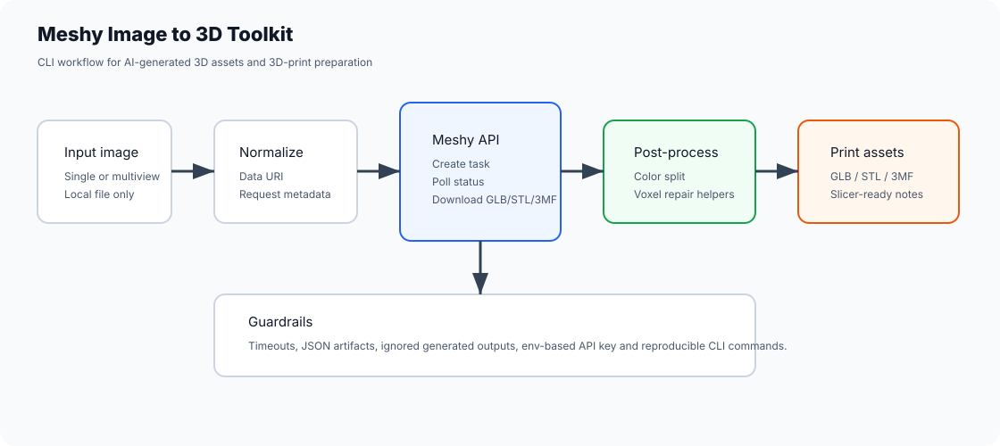
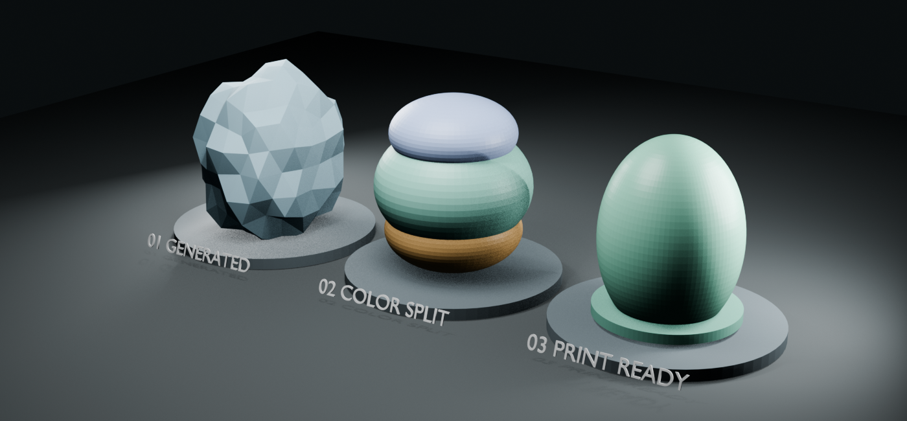

# Meshy Image to 3D Toolkit

Portfolio-friendly toolkit for automating an image-to-3D workflow with the Meshy API, then preparing the generated model for 3D printing.





## What it demonstrates

- Node.js CLIs for Meshy `image-to-3d`, `multi-image-to-3d`, and print endpoints.
- Local image normalization to Data URI without uploading files to another service first.
- Polling, timeout handling, JSON artifact capture, and model downloads.
- Python helpers for multi-view image crops, color-based GLB splitting, and Blender voxel repair.
- Practical 3D printing workflow thinking: GLB/3MF/STL outputs, color separation, texture cleanup, and slicer-ready files.
- A deterministic print-readiness report for watertightness, connected components, positive volume, thin-wall screening and build volume.

## Requirements

- Node.js 18+
- Python 3.10+
- Meshy API key
- Optional: Blender for voxel repair helpers

## Setup

```bash
npm install
copy .env.example .env
```

Set `MESHY_API_KEY` in `.env`.

## Common commands

```bash
npm run image-to-3d -- --image samples/input.png --formats glb,3mf
```

```bash
npm run multi-image-to-3d -- --images "front.png,side.png,back.png" --formats glb,3mf
```

```bash
npm run meshy-print -- --mode analyze --task-id <task-id>
```

```bash
npm run split-by-color -- --input outputs/model.glb --output outputs/split/model
```

```bash
npm run repair-voxel -- --input outputs/split/model-preto.glb --output outputs/repaired/model-preto.stl --voxel-size 0.01
```

Generate an inspectable quality report from sanitized mesh measurements:

```bash
npm run mesh-quality -- docs/demo/synthetic-mesh-metrics.json --output outputs/mesh-quality-report
```

## Repository hygiene

Generated models, thumbnails, samples, `.env` files, and API responses are intentionally ignored. This keeps the public repo focused on code and workflow, not private assets or generated customer files.

## CI

GitHub Actions runs Node syntax checks for the CLIs and compiles the Python helpers.

## Portfolio angle

This project is useful for recruiters because it shows API integration, CLI ergonomics, file-processing automation, 3D data handling, and production-minded guardrails around generated assets. See [docs/portfolio-case-study.md](docs/portfolio-case-study.md).
